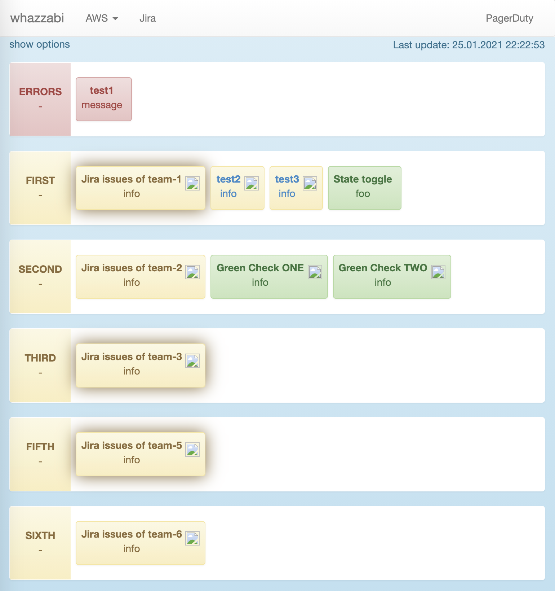

# whazzup
A dashboard for product teams. Focusing on whats wrong, hiding the noise.



* To run the example just run ``ideas-dash/dash-example/src/main/java/de/axelspringer/ideas/tools/dash/example/ExampleDash.java``

## Quickstart
Create a Spring-Boot-Application and add this dependency

```xml
<dependency>
    <groupId>io.github.whazzabi</groupId>
    <artifactId>whazzup-core</artifactId>
    <version>${latest-whazzup-version}</version>
</dependency>
```

See the [./whazzup-example]() module for an example.

## Terms
* CheckResults can be grouped in the UI. Thats what Groups are for
* Teams are used as filters. This way many teams can share (no team specified) checks/results or have checks executed that only concern them and not interfere with other teams

## Supported Checks
### Jenkins
Jenkins can be queried for build results if you provide JenkinsChecks via a CheckProvider. JenkinsJobListCheckProvider may come in handy for you as it parses the complete list of jenkins jobs for specified patterns and creates JenkinsChecks automatically.
No more manual configuration for these.

### Jira
Jira can be queried for issues (Bugs, Stories, Whatever). You may like to take a look at JiraQueryBuilder as a starting point for creating JiraChecks.

### Fabric
FabricCheck

### DataDog
DataDog can be queried for monitors. Just provide DataDogChecks via a CheckProvider.

### Art-Tests
Art is supported as well in theory. This was not used in a while and may prove unstable.

### Statushub
Statushub is supported as well. Markup will be parsed for css-classes (incident)

### Cloudwatch
Cloudwatch is supported as well. Just initialize a CloudWatchCheck providing your aws-id, secret and aws region (instantiate different checks for different regions).

## Philips Hue overall-state indicator
You can connect philips hue to the dash to indicate the overall state more "physically".

What you have to do:

1. Connect the hue-bridge to the same network as the computer running the dash. if you want to connect it directly you need to enable a dhcp-server on the machine.
For windows you could use something like http://www.dhcpserver.de/ (dont forget to add firewall exceptions).
1. Find the bridge IP and go to http://bridge.ip/debug/clip.html
1. Create new developer by firing a POST request with a payload like this: {"devicetype":"my_hue_app#gaffa"} against /api and holding the key on the bridge at the same time (following http://www.developers.meethue.com/documentation/getting-started) - you will receive a 'username' which you shall enter in the "key" - field of yana-dash.
1. If you want to register a new light, POST a request against /api/key/lights with a payload like this: {"deviceid":["34AFBE"]} 
(deviceide being the serial on the bulb)
1. Fire a GET request against /api/yourkey/lights and find the light you want to use
1. Enter the bridge ip, the key and the light # in the hue configuration in the dash ui
